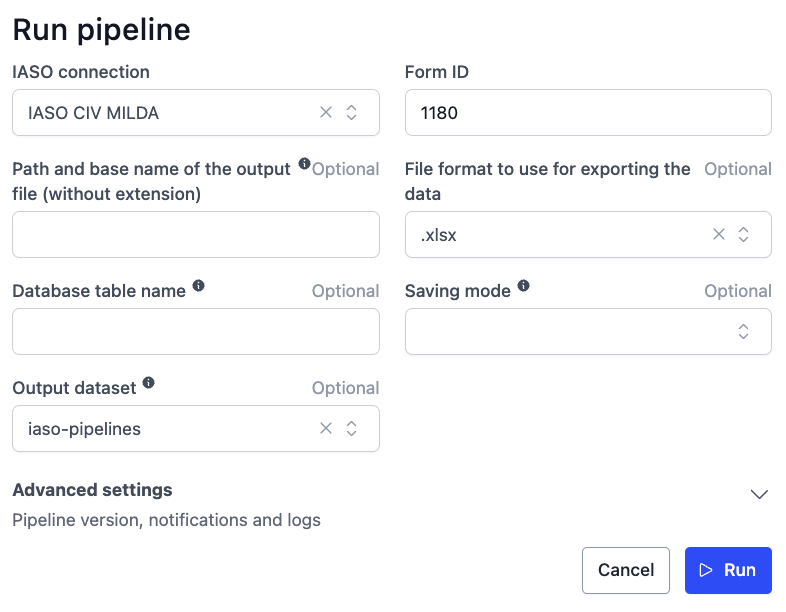
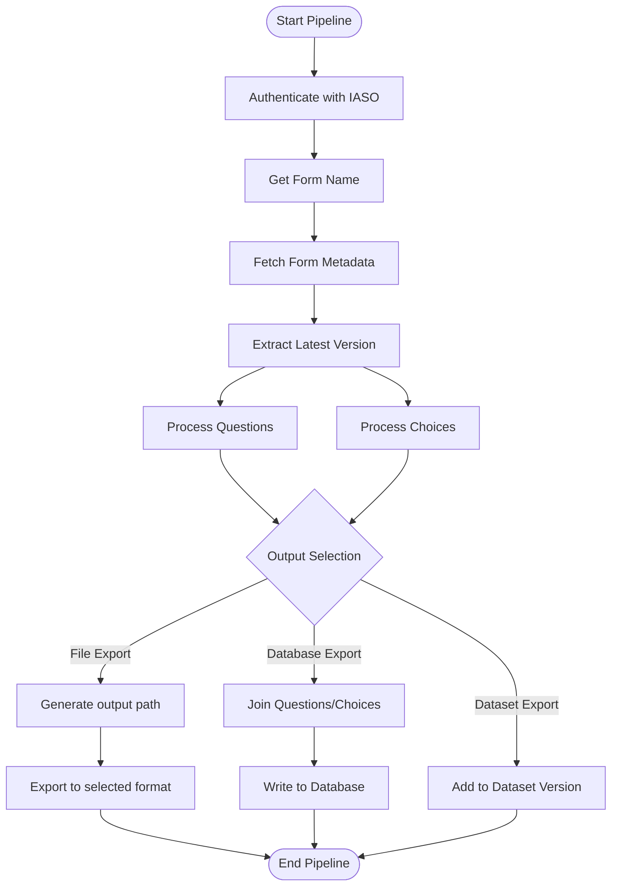

# IASO Form Metadata Extraction Pipeline

## 📌 Description

This pipeline extracts detailed metadata about IASO forms, including questions and choices definitions. Key features:
- Authenticates with IASO using provided credentials
- Retrieves form structure and question definitions
- Fetches choice options with labels and values
- Exports to multiple formats (CSV, Parquet, Excel)
- Supports database export with join between questions and choices
- Integrates with OpenHexa Datasets for versioned metadata storage

## 💻 Usage Example

## ⚙️ Parameters

| Parameter | Type | Required | Default | Description |
|-----------|------|----------|---------|-------------|
| `iaso_connection` | IASOConnection | Yes | - | Authentication details for IASO (url, username, password) |
| `form_id` | int | Yes | - | ID of the form to extract metadata from |
| `output_file_name` | str | No | - | Custom output path/filename (without extension) |
| `output_format` | str | No | `.parquet` | Export file format (`.csv`, `.parquet`, `.xlsx`) |
| `db_table_name` | str | No | - | Target database table name for storage |
| `save_mode` | str | No | `replace` | Database write mode (`append` or `replace`) |
| `dataset` | Dataset | No | - | Target OpenHexa Dataset for export |

## Execution Workflow
