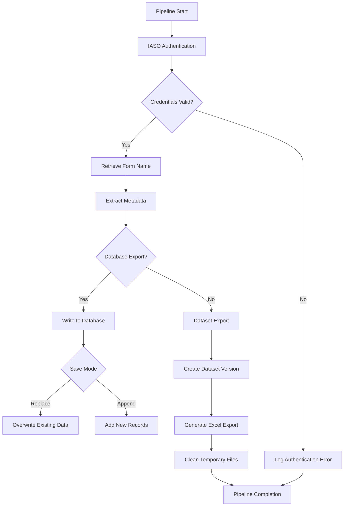

# IASO Form Metadata Extraction Pipeline

## 📌 Description

This pipeline is designed to extract metadata from an IASO form, process it, and store it in a database or dataset. The extracted metadata includes questions and choices from the form, which can be used for reporting, analysis, or integration into other systems.


## ⚙️ Parameters

| Parameter        | Type            | Required | Default | Description |
|-----------------|----------------|----------|---------|-------------|
| `iaso_connection` | `IASOConnection` | ✅ | - | IASO connection credentials. |
| `form_id` | `int` | ✅ | - | The ID of the IASO form to extract metadata from. |
| `db_table_name` | `str` | ❌ | `md_<form_name>` | Name of the database table to store metadata. |
| `save_mode` | `str` | ✅ | `"replace"` | Saving mode: `"append"` or `"replace"`. |
| `dataset` | `Dataset` | ❌ | - | Dataset to store metadata files. |


## 📥 Data Acquisition Process

1. **Authenticate to IASO**: Connects to the IASO API using the provided credentials.
2. **Retrieve Form Name**: Fetches and sanitizes the name of the form based on its ID.
3. **Extract Metadata**: Retrieves form questions and choices from IASO.
4. **Export Metadata**:
   - To a database if `db_table_name` is provided.
   - To a dataset if `dataset` is provided. 

## 🔄 Data Processing Workflow

1. **Authentication**
   - Validate IASO credentials
   - Establish API connection

2. **Form Verification**
   - Confirm form existence
   - Sanitize form name using `clean_string()`

3. **Metadata Extraction**
   - Retrieve structured metadata:
   ```python
   {
     "questions": ["name", "type", "label", "calculate"],
     "choices": ["name", "value", "label"]
   }
   ```

4. **Data Export**
   - Database: Merged relational structure
   - Dataset: Versioned Excel exports

5. **Resource Management**
   - Temporary file cleanup
   - Connection termination

## 💻 Usage Example


## 🔄 Flow

