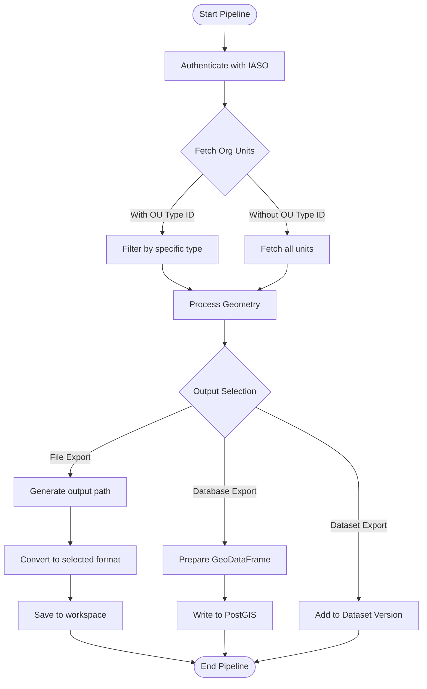

# IASO Organizational Units Extraction Pipeline

## 📌 Description

This pipeline extracts organizational units data from the IASO platform based processes and cleans the data, and then exports it to the specified destination (file, database, or OpenHEXA dataset).
Key features:
- Authenticates with IASO using provided credentials
- Fetches organizational units data (optionally filtered by type)
- Handles geometry conversion for spatial data
- Exports to various file formats (CSV, GeoPackage, GeoJSON, Parquet, Shapefile, TopoJSON, Excel)
- Supports database export to spatial databases (PostGIS)
- Integrates with OpenHexa Datasets for versioned data storage

## 💻 Usage Example

## ⚙️ Parameters

| Parameter | Type | Required | Default | Description |
|-----------|------|----------|---------|-------------|
| `iaso_connection` | IASOConnection | Yes | - | Authentication details for IASO (url, username, password) |
| `ou_type_id` | int | No | - | Specific organization unit type ID to filter results |
| `output_file_name` | str | No | - | Custom output path/filename (without extension) |
| `output_format` | str | No | .gpkg | Export file format (`.csv`, `.gpkg`, `.geojson`, `.parquet`, `.shp`, `.topojson`, `.xlsx`)|
| `db_table_name` | str | No | - | Target database table name for storage |
| `save_mode` | str | No | - | Database write mode ('append' or 'replace') |
| `dataset` | Dataset | No | - | Target OpenHexa Dataset for export |

## 🔄 Pipeline Flow

