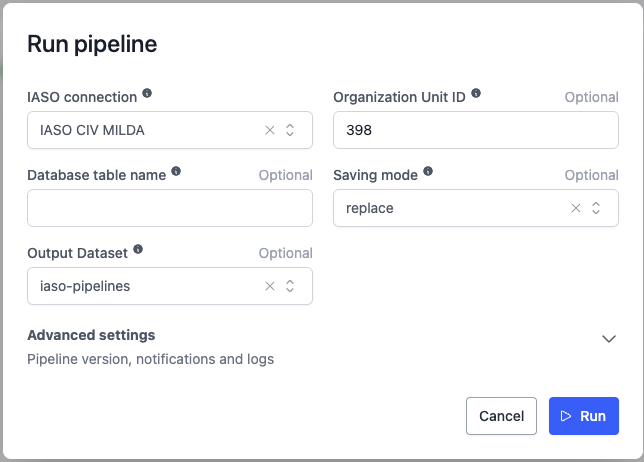
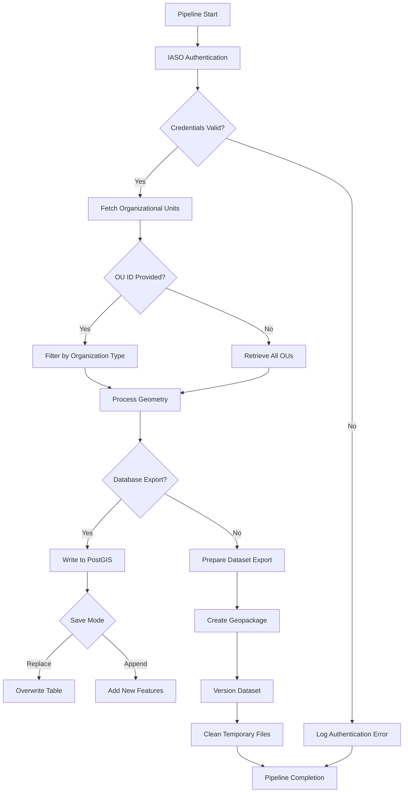

# IASO Organizational Units Extraction Pipeline

## 📌 Description

This pipeline extracts organizational units (OU) data from the IASO platform, processes spatial geometries, and exports it to either a spatial database or geopackage dataset. It supports both full exports and filtered extracts based on organizational unit type.

## ⚙️ Parameters

| Parameter | Type | Required | Default | Description |
|-----------|------|----------|---------|-------------|
| `iaso_connection` | `IASOConnection` | ✅ | - | Authenticated IASO connection credentials |
| `ou_id` | `int` | ❌ | - | Specific organization unit type ID to filter (optional).|
| `db_table_name` | `str` | ❌ | `ou_<type>` or `orgunits` | Target database table name |
| `save_mode` | `str` | ✅ | `"replace"` | Database write mode: `append` or `replace` |
| `dataset` | `Dataset` | ❌ | - | Target dataset for geopackage export (optional).|

## 📥 Data Acquisition Process

1. **IASO Authentication**  
   - Validate credentials through IASO API
   - Establish secure connection

2. **Data Retrieval**  
   - Fetch all organizational units or filter by OU type
   - Optionally filter the data using the provided `ou_id`.

3. **Geometry Processing**  
   - Convert GeoJSON to proper spatial types (Point/MultiPolygon)
   - Coordinate system standardization (EPSG:4326)

## 🔄 Data Processing Workflow

### 1. Authentication & Validation
- Verify IASO API endpoint accessibility
- Validate credentials before data extraction

### 2. Data Transformation
```python
{
  "id": "OU-123",
  "name": "Health Center",
  "org_unit_type": "Facility",
  "geometry": <MultiPolygon>,
  "created_at": "2023-07-15",
  "updated_at": "2023-07-15"
}
```

### 3. Spatial Export Options
- **Database**: Write to PostGIS with topology preservation
- **Dataset**: Versioned geopackage exports with timestamps

### 4. Quality Assurance
- Invalid geometry filtering
- Automatic field sanitization
- Transactional error handling

## 💻 Usage Example


## 🔄 Pipeline Flow



## 🛠️ Technical Features
- **Spatial Integrity**: Automatic geometry validation and conversion
- **Idempotent Operations**: Safe retries through transactional writes
- **Metadata Preservation**: Maintains IASO timestamps and identifiers
- **Scalable Processing**: Handles large datasets with streaming

## 📦 Output Formats
| Destination | Format | Features |
|-------------|--------|----------|
| Database | PostGIS | Topology-preserving binary storage |
| Dataset | Geopackage | Versioned spatial packages with metadata |
