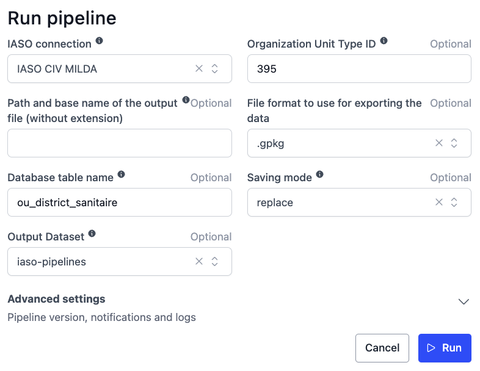

# IASO Organizational Units Extraction Pipeline

## 📌 Description

This pipeline extracts organizational units (OU) data from the IASO platform, processes spatial geometries, and exports it to either a spatial database or geopackage dataset. It supports both full exports and filtered extracts based on organizational unit type.

It supports:
- Full extractions or filtered extracts by organization unit type.
- Multiple export formats including spatial and non-spatial data.
- Optional export to PostGIS databases or versioned OpenHexa datasets.

## ⚙️ Parameters

| Parameter            | Type             | Required | Default   | Description |
|----------------------|------------------|----------|-----------|-------------|
| `iaso_connection`    | `IASOConnection` | ✅       | -         | Authenticated IASO API connection |
| `ou_id`              | `int`            | ❌       | `None`    | Specific organization unit type ID to filter (optional). |
| `output_file_name`   | `str`            | ❌       | Auto      | Custom output filename (with or without extension) |
| `output_format`      | `str`            | ❌       | `.gpkg`   | Export format: `.csv`, `.geojson`, `.parquet`, `.shp`, `.gpkg`, `.topojson`, `.xlsx` |
| `db_table_name`      | `str`            | ❌       | -         | If provided, exports the result to this DB table |
| `save_mode`          | `str`            | ❌       | `replace` | Database write mode: `replace` or `append` |
| `dataset`            | `Dataset`        | ❌       | -         | Target dataset for geopackage export (optional). |

## 📥 Data Acquisition Process

1. **IASO Authentication**  
   - Validate credentials through IASO API
   - Establish secure connection

2. **Data Retrieval**  
   - Fetch all organizational units or filter by OU type
   - Optionally filter the data using the provided `ou_id`.

3. **Geometry Processing**  
   - Convert GeoJSON to proper spatial types (Point/MultiPolygon)
   - Coordinate system standardization (EPSG:4326)

4. **Export Options**
   - File export (to disk)
   - Database export (PostGIS)
   - Dataset export (OpenHexa versioned)

## 🔄 Data Processing Workflow

### 1. Authentication & Validation
- Verify IASO API endpoint accessibility
- Validate credentials before data extraction

### 2. Data Transformation
```python
{
  "id": "OU-123",
  "name": "Health Center",
  "org_unit_type": "Facility",
  "geometry": <MultiPolygon>,
  "created_at": "2023-07-15",
  "updated_at": "2023-07-15"
}
```

### 3. Spatial Export Options
- **File**: Write to OpenHEXA file directory
- **Database**: Write to PostGIS with topology preservation
- **Dataset**: Versioned geopackage exports with timestamps

### 4. Quality Assurance
- Invalid geometry filtering
- Automatic field sanitization
- Transactional error handling

## 💻 Usage Example


## 🔄 Pipeline Flow


## 🛠️ Technical Features
- **Spatial Integrity**: Automatic geometry validation and conversion
- **Idempotent Operations**: Safe retries through transactional writes
- **Metadata Preservation**: Maintains IASO timestamps and identifiers
- **Scalable Processing**: Handles large datasets with streaming

## 📦 Output Formats
| Destination | Format | Features |
|-------------|--------|----------|
| Database | PostGIS | Topology-preserving binary storage |
| Dataset | Geopackage | Versioned spatial packages with metadata |
