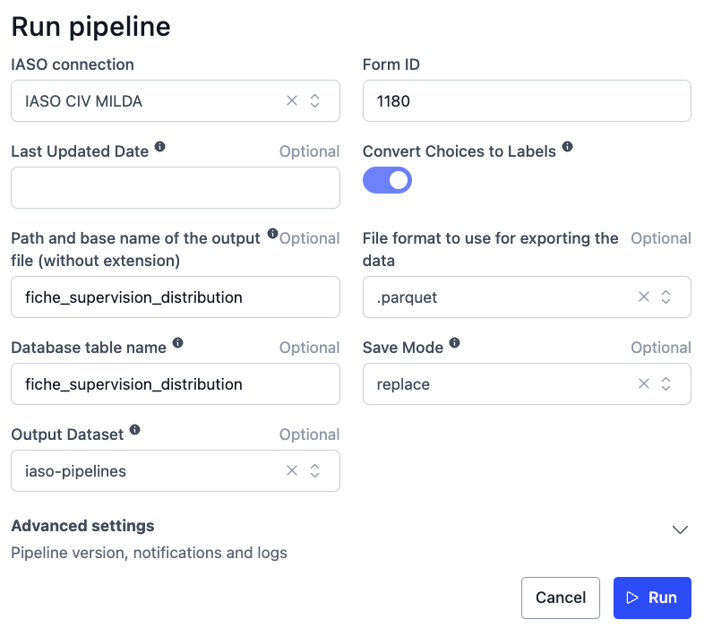
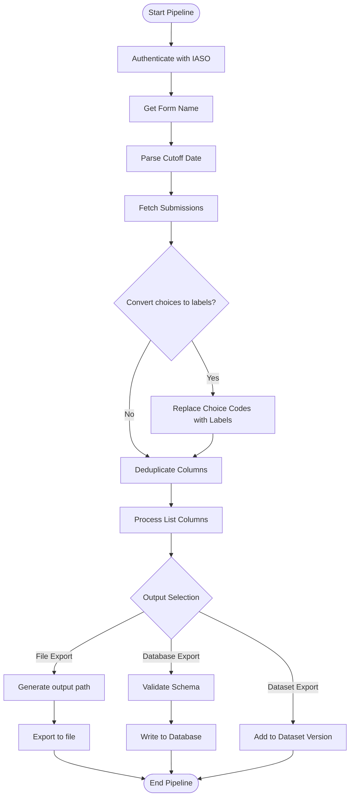

# IASO Form Submissions Extraction Pipeline

## 📌 Description

This pipeline extracts and processes form submissions data from the IASO platform. Key features:
- Authenticates with IASO using provided credentials
- Fetches form submissions (optionally filtered by last updated date)
- Converts choice codes to human-readable labels (optional)
- Processes and cleans the data (deduplicates columns, handles list-type responses)
- Exports to multiple formats (CSV, Parquet, Excel)
- Supports database export with schema validation
- Integrates with OpenHexa Datasets for versioned data storage

## 💻 Usage Example

## ⚙️ Parameters

| Parameter | Type | Required | Default | Description |
|-----------|------|----------|---------|-------------|
| `iaso_connection` | IASOConnection | Yes | - |Authentication details for IASO (url, username, password) |
| `form_id` | int | Yes | - |ID of the form to extract submissions from |
| `last_updated` | str | No | - | ISO date (YYYY-MM-DD) for incremental extraction (only submissions updated after this date) |
| `choices_to_labels` | bool | No | `True` | Convert choice codes to labels |
| `output_file_name` | str | No | - | Custom output path/filename (without extension) |
| `output_format` | str | No | `.parquet` | Export file format (`.csv`, `.parquet`, `.xlsx`) |
| `db_table_name` | str | No | - | Target database table name for storage |
| `save_mode` | str | No | `replace` | Database write mode (`append` or `replace`) |
| `dataset` | Dataset | No | - | Target OpenHexa Dataset for export |

## 🔄 Pipeline Flow
