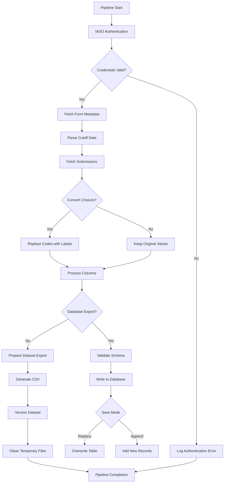

# IASO Form Submissions Extraction Pipeline

## 📌 Description

This pipeline extracts form submission data from the IASO platform, processes choice values into human-readable labels, and exports results to databases or versioned datasets. Supports incremental updates and schema validation.

## ⚙️ Parameters

| Parameter | Type | Required | Default | Description |
|-----------|------|----------|---------|-------------|
| `iaso_connection` | `IASOConnection` | ✅ | - | IASO API credentials |
| `form_id` | `int` | ✅ | - | Target form identifier |
| `last_updated` | `str` | ❌ | - | An ISO-formatted date (YYYY-MM-DD) used as a cutoff for incremental data extraction. |
| `choices_to_labels` | `bool` | ❌ | `True` | Flag to determine if choice codes should be replaced with human-readable labels. |
| `db_table_name` | `str` | ❌ | `form_<name>` | Target name for the database table (if not provided, defaults to `form_<form_name>`).|
| `save_mode` | `str` | ✅ | `"replace"` | Write mode: `append`/`replace` |
| `dataset` | `Dataset` | ❌ | - | Target dataset for CSV exports |

## 📥 Data Acquisition Process

1. **IASO Authentication**  
   - Validate credentials through OAuth2
   - Establish secure API connection

2. **Form Verification**  
   - Validate form existence
   - Sanitize form name

3. **Submission Retrieval**  
   - Fetch submissions with optional date filter
   - Automatic pagination handling

4. **Data Processing**  
   - Choice code → label conversion
   - Column deduplication
   - List-type field expansion

## 🔄 Data Processing Workflow

### 1. Authentication & Validation
- Credential verification
- Form ID existence check

### 2. Export Options
- **Database**: Schema validation with auto-fallback
- **Dataset**: Versioned CSV exports with timestamps

### 4. Quality Assurance
- Column name sanitization
- Duplicate handling
- Temporary file cleanup

## 💻 Usage Example

## 🔄 Pipeline Flow

## 🛠️ Technical Features
- **Incremental Loading**: Date-filtered extraction
- **Data Integrity**: Schema validation pre-export
- **Language Support**: French label conversion
- **Error Resilience**: Transactional writes with rollback

## 📦 Output Formats
| Destination | Format | Features |
|-------------|--------|----------|
| Database | SQL Table | Type-safe storage with schema validation |
| Dataset | Versioned CSV | Historical tracking with metadata |

## 🔒 Data Security
- Credential encryption through OpenHexa
- Temporary file purging
- GDPR-compliant data handling
- API request throttling
