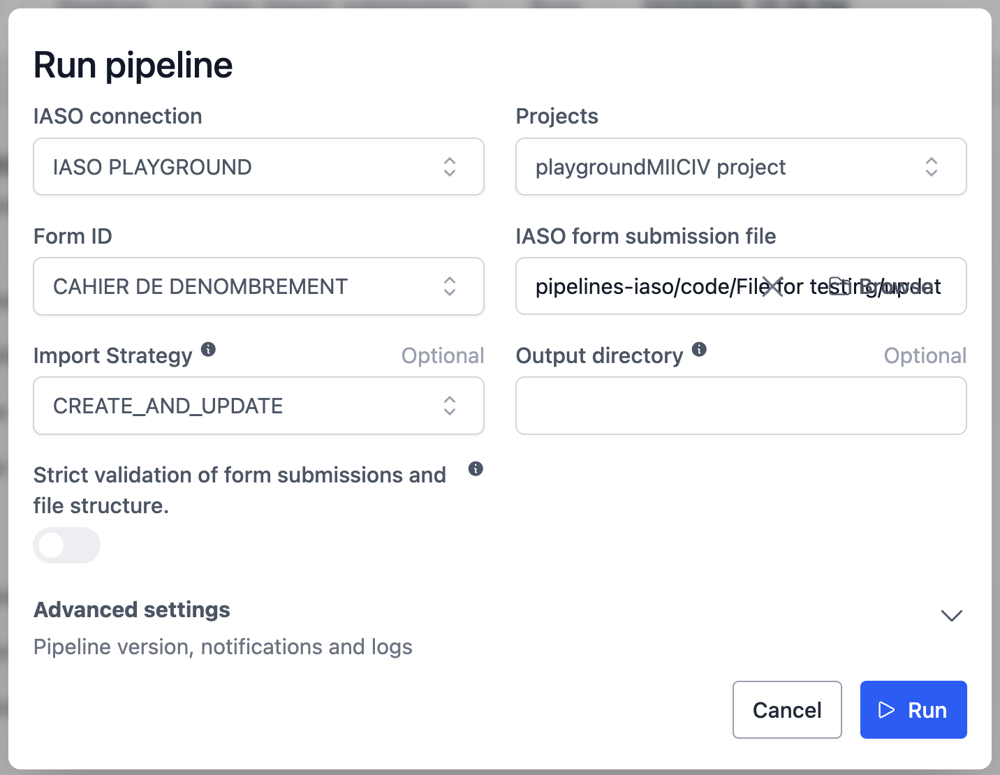
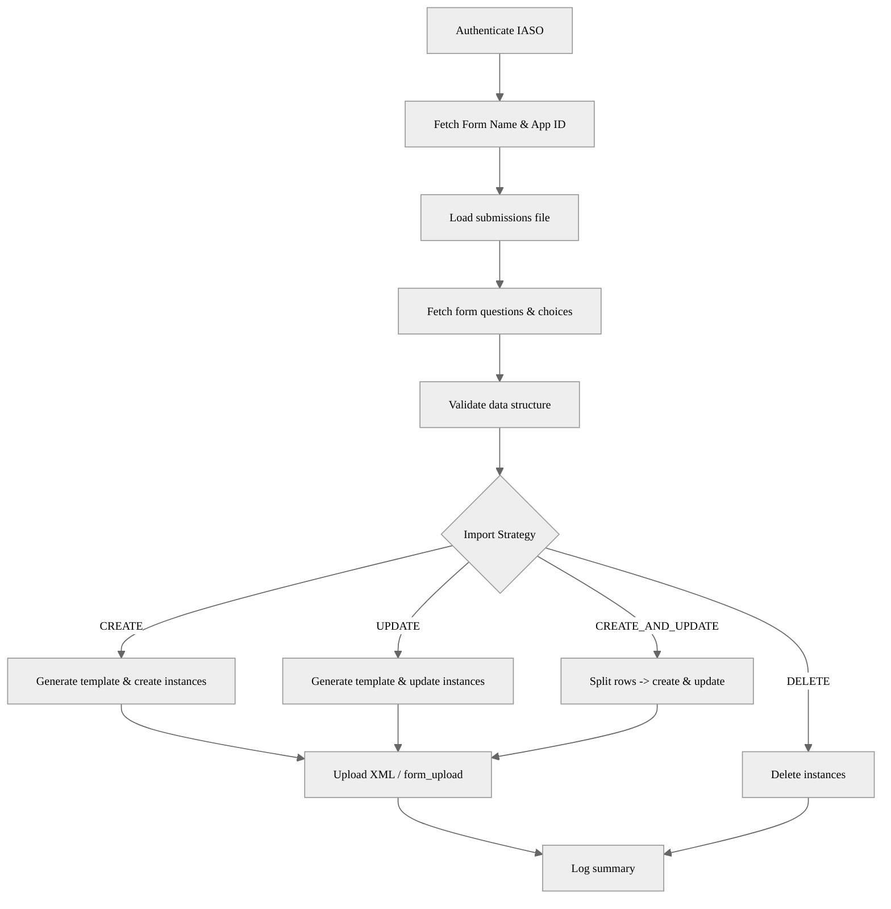

# IASO Form Submissions Import Pipeline

## Description
This OpenHEXA pipeline (`iaso_import_submissions`) imports, updates and deletes IASO form submissions from a tabular file (CSV/ Excel / Parquet) into an IASO instance. It supports four strategies:

- `CREATE`: Create new instances from rows without an `id` column on input file.
- `UPDATE`: Update existing instances using `id` (numeric IASO Instance ID) and `instanceID` (UUID, usually prefixed `uuid:`).
- `CREATE_AND_UPDATE`: Split the input rows into creations (`id` null) and updates (`id` present) and process each side.
- `DELETE`: Delete existing instances referenced by `id`.

The pipeline builds OpenRosa-compliant XML payloads, enriches them with instance/user metadata, and uploads them through IASO's `/api/instances` and `/sync/form_upload/` / Enketo edit endpoints.

## Example Usage
1. Select an IASO connection, project and form.
2. Upload a submissions file exported from another system or prepared manually.
3. Choose an import strategy (default: CREATE).
4. Optionally enable strict validation to enforce schema and constraints strictly.
5. Run the pipeline and inspect output summary + generated XML files.


## Parameters
| Parameter | Type | Required | Default | Description |
|-----------|------|----------|---------|-------------|
| IASO connection (`iaso_connection`) | IASOConnection | Yes | - | Authenticated connection used for API calls |
| Projects (`project`) | Integer | Yes | - | IASO Project numeric ID (used to derive App ID) |
| Form ID (`form_id`) | Integer | Yes | - | Target IASO Form numeric ID |
| IASO form submission file (`input_file`) | File | Yes | - | Source file containing rows of submissions (Polars-readable) |
| Import Strategy (`import_strategy`) | String (choice) | No | `CREATE` | One of CREATE, UPDATE, CREATE_AND_UPDATE, DELETE |
| Output directory (`output_directory`) | String | No | Auto: `iaso-pipelines/import-submissions/<form_name>` | Base output folder for generated XML & summaries |
| Strict validation (`strict_validation`) | Boolean | No | `False` | Enforces data structure, types, and constraint/choices validation (invalid rows ignored) |

### Additional Column Expectations
Depending on strategy the input file must include:
- `CREATE`: `org_unit_id` (and optionally latitude / longitude / altitude / accuracy)
- `UPDATE`: `id` (numeric IASO Instance ID) and `instanceID` (UUID with or without `uuid:` prefix); optional location columns for patching.
- `CREATE_AND_UPDATE`: Combination of above; rows with `id` null are treated as CREATE.
- `DELETE`: `id` only.

If the form has multiple versions and the input includes a `form_version` column, the pipeline generates version-specific XML templates; otherwise it uses the latest version metadata and performs a global validation pass to prepare constraint/choice summaries.

## Output
Typical output artefacts (under the resolved output directory):

```
<workspace>/files/iaso-pipelines/import-submissions/<form_name>/
  creates/        # XML files for created submissions (CREATE / CREATE side)
  updates/        # XML files for updated submissions (UPDATE / UPDATE side)
  deletes/        # (optional) logs only; no XML produced
  summary.json     # Log-driven summary (in run logs)
```

Summary counts reported in run logs:
```json
{
  "imported": <int>,
  "updated": <int>,
  "ignored": <int>,
  "deleted": <int>
}
```

Ignored rows arise from failed validation, missing required columns, API failures, or locked instances in update mode.

## Data Structure & Validation
Validation steps (when `strict_validation=True`):
1. Schema/type enforcement (casts attempted where possible).
2. Constraint & choices summaries
  - If the submissions file **does not** include a `form_version` **column**: a single, global constraint set is used.
  - If the submissions file **does** include a `form_version` **column**: constraints are determined **per row**, based on the row’s `form_version` value (via form questions).
3. Row-level field constraint validation (during template selection).
4. Rows failing validation contribute to `ignored`.

When `strict_validation=False`, all rows pass validation unless critical columns (e.g. `id` for UPDATE) are missing.

## Pipeline Flow


## Examples
### Minimal CREATE file
| org_unit_id | latitude | longitude | field_a | field_b |
|-------------|----------|-----------|---------|---------|
| 123 | 4.4 | 4.5 | valueA1 | valueB1 |
| 456 | 6.0 | 6.2 | valueA2 | valueB2 |

### Minimal UPDATE file
| id | instanceID | org_unit_id | field_a |
|----|------------|-------------|---------|
| 987 | 473957 | 123 | newValue |

## Troubleshooting
| Issue | Cause | Resolution |
|-------|-------|------------|
| Many rows ignored | Missing required columns or validation failures | Enable |debug logging; ensure `org_unit_id`, `id`, `instanceID` present as needed |
| Update skipped (locked) | Instance flagged `is_locked` in IASO | Unlock instance in IASO or omit from update batch |
| XML upload fails (status ≠ 201) | Invalid XML or server error | Inspect generated XML file; validate namespaces & instanceID |
| Missing namespaces in edited XML | ElementTree stripped unused prefixes | Function re-injects `xmlns:jr` & `xmlns:orx` automatically |
| Wrong UUID in update | `instanceID` missing `uuid:` prefix | Prefix handled; ensure raw value present |